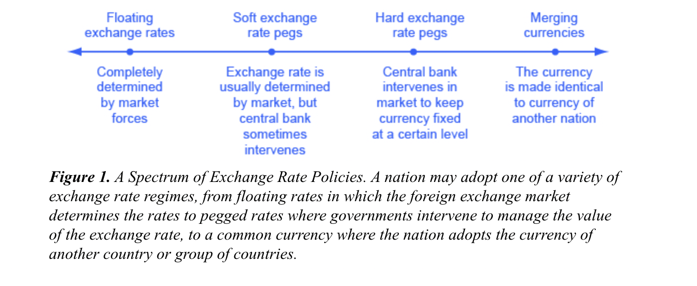
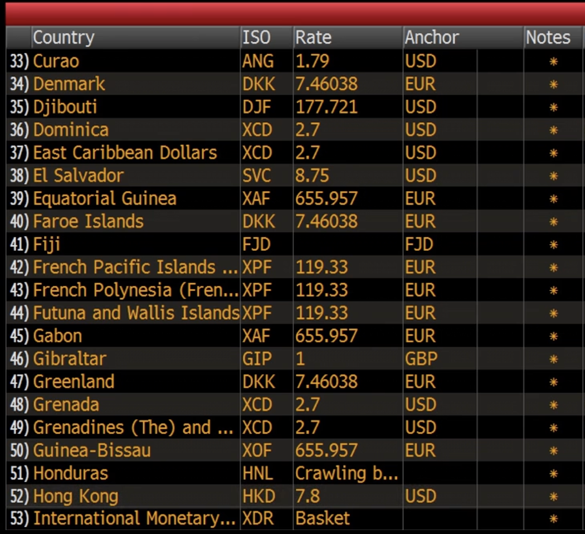
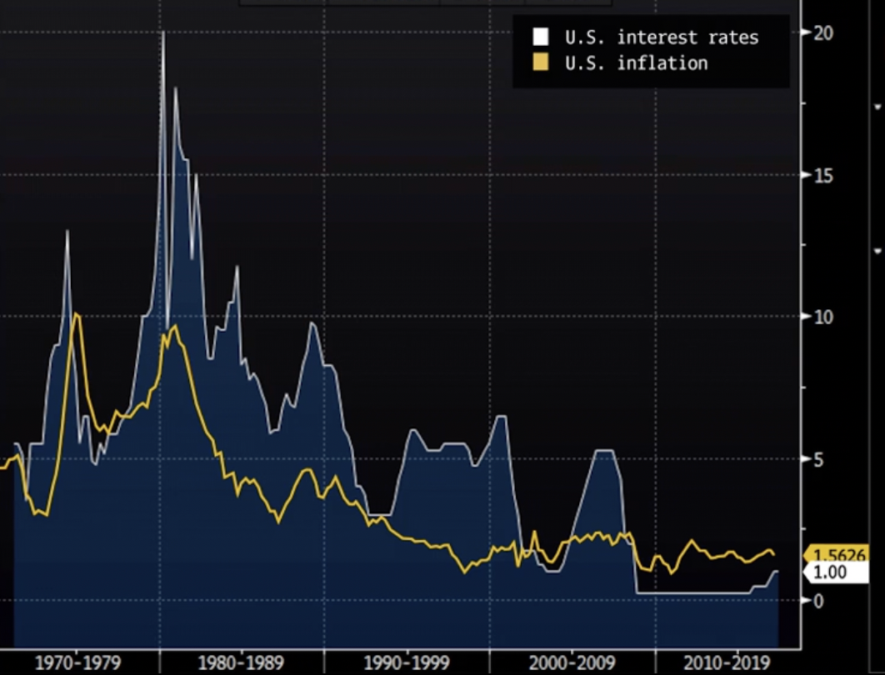
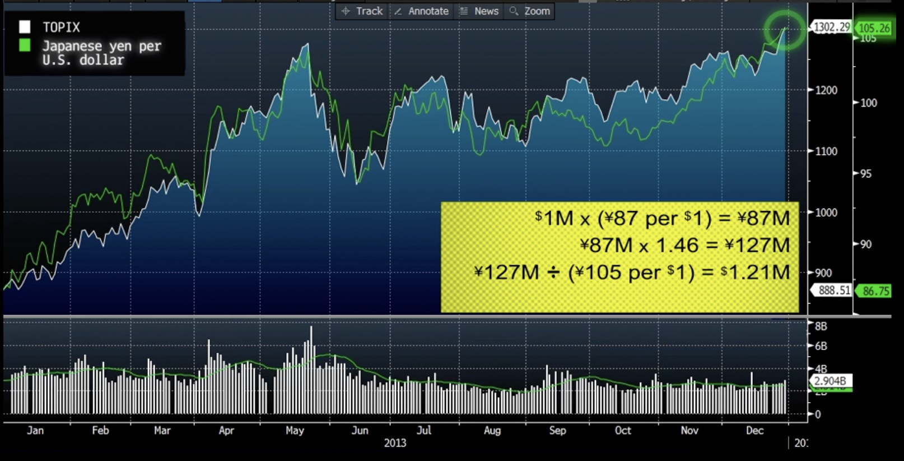

# Currencies

### Who trades currencies?

- Financial Investors: Also known as hot money. They trade securities in foreign currencies. Include banks, security firms, institutional investors etc.
- Corporations: Large companies who transact their goods and services across borders.
- Travellers: Exchanging currency for personal usage.

Currency rates are determined either by floating rates or fixed rates. Floating currencies are the one whose value is determined by the supply-demand in the open market which includes international trade, foreign investments etc. On the other hand, in case of fixed currencies, the value of a currency is fixed with another currency, also called ‘pegging’.

### Pegged Currencies

When the value of a currency is locked/pegged or kept fixed with respect to another currency.

The primary idea behind pegging a currency is to stabilise exchange rate between countries, promote trade and business agreements. Small countries generally have a currency peg with a larger and developed economy in order to have access to broader markets with lesser risk.

### How does Pegging work?

Every nation maintains a reserve of foreign currency called forex reserves. When market forces, lets say brings the value of a currency down, the central bank creates an artificial demand in the market to bring its value up by either either trading its forex reserves, or altering monetary policies (lower interest rates). On the other hand, if the value of a currency is appreciated, the central bank creates more local currency or increases interest rates to bring its value down and eventually maintain the peg. [Read more here.](https://opentextbc.ca/principlesofeconomics/chapter/29-4-exchange-rate-policies/)

### How to value a currency?

Currency pair exchange rates only convey the relative value of two currency. The strength of a currency is represented by trade weighted index, which takes into account the exchange rate of that currency with its major trade partners.

### How does value of a currency change?

The strength of a currency can change due to various factors such as:

- Surprise changes in interest rates
- Surprise changes in inflation
- Surprise changes in trade

**Surprise changes in interest rates:** When the central bank of a country reduces the interest rates, bond yields of that government go down. This deters investment from all around the world, reducing the demand of that currency and hence weakening it. The opposite happens when interest rates of the country increases.

**Surprise rises in inflation:** Due to growth in supply of a currency wrt another currency, its value diminishes due to inflation.

**Surprise changes in trade:** Increasing exports lead to a higher demand for the home currency hence strengthening it. A trade deficit(import > export) on the other hand weakens the currency.  ****

### Response of Central Banks to Inflation

When inflation rises, central banks raise the interest rates to slow down the economy by making it difficult to borrow. 

US Interest Rates vs CPI(Inflation)

### The inconvenience of currency risk

Imagine you are a US based investor willing to invest in Japanese stocks in 2013.

If you had invested $1M in the beginning of the year, you would have earned $1.21M at the end of 2013. Even if you got 46% returns in JPY, you earned only 21% in USD. This is due to the weakening JPY wrt USD. The higher the TOPIX points (Tokyo Market Index), weaker is the JPY.

**Reason:** Japan is an highly exporting country. A weakening JPY, makes its goods more attractive to foreigners thus increase company revenues, profits and consequently the market index.

### How to assess currency risk?

- **Historical Volatility** - Based on historical data, the volatility of an currency exchange rate is a good measure of the risk one has to tolerate while transacting between those two currencies.
- **Analyst Forecasts** - Average of the estimates of various investment bank analyst teams.

### Hedging against currency risk

You can participate in Forex forward contracts to protect yourself against a weakening currency.
